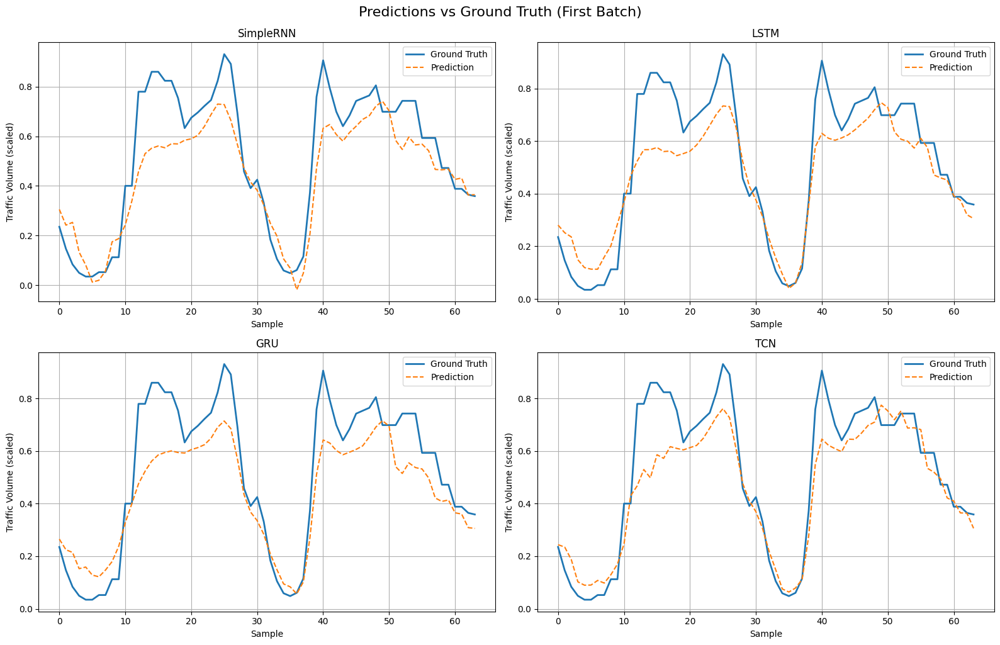
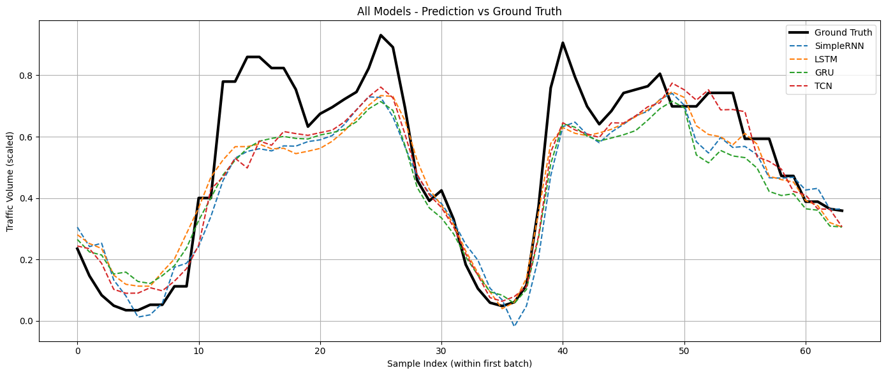

# 🚦 Deep Learning for Traffic Volume Forecasting  
**A Comparative Study of RNN, LSTM, GRU, and TCN on the Metro Interstate Traffic Volume Dataset**

---

## 📌 Project Overview

This project evaluates the performance of four deep learning models — **SimpleRNN**, **LSTM**, **GRU**, and **TCN** — for short-term traffic volume prediction using time series data. We use the [Metro Interstate Traffic Volume Dataset](https://archive.ics.uci.edu/ml/datasets/Metro+Interstate+Traffic+Volume) containing hourly traffic counts and weather conditions recorded in Minnesota, USA.

---

## 🗃️ Dataset

- **Source**: [UCI ML Repository](https://archive.ics.uci.edu/ml/datasets/Metro+Interstate+Traffic+Volume)
- **Samples**: ~48,000 hourly records
- **Features**: Temperature, rain, snow, cloud cover, hour, and more

---

## 🧠 Models Compared

| Model       | Description                                         |
|-------------|-----------------------------------------------------|
| SimpleRNN   | Vanilla recurrent model, limited memory capacity    |
| LSTM        | Gated recurrent model with long-term memory         |
| GRU         | Lightweight gated model, faster training            |
| TCN         | Temporal Convolutional Network with dilated 1D conv |

---

## ⚙️ Technical Setup

- **Input Sequence**: 24 hours
- **Task**: Forecast next-hour traffic volume
- **Framework**: PyTorch
- **Training Split**: 80/20 train/test

---

## 📦 How to Run

```bash
git clone https://github.com/moody-taco/Traffic-Volume-Forecasting
cd traffic-volume-prediction
pip install -r requirements.txt
python notebook.ipynb  # or run all cells in Jupyter
```

---

## 📊 Final Test Performance

| Model     | Test MSE ↓ |
|-----------|------------|
| SimpleRNN | 0.0198     |
| LSTM      | 0.0186     |
| GRU       | 0.0187     |
| TCN       | **0.0181** |

- **TCN** achieved the best generalization performance.
- **GRU** performed nearly as well as **LSTM** with fewer parameters.
- **SimpleRNN** underperformed due to vanishing gradient issues.

---

## 📈 Visualization

### 🔹 Subplot Comparison of Predictions vs Ground Truth  


### 🔸 Combined Prediction Overlay  


---

## 📌 Conclusion

This comparative study highlights the strengths and weaknesses of different deep learning architectures for time series forecasting:

- **SimpleRNN** struggles with long-term dependencies and tends to over-smooth predictions.
- **LSTM** and **GRU** offer substantial improvements due to their gating mechanisms, with GRU achieving similar accuracy as LSTM at a lower computational cost.
- **TCN** outperformed all RNN-based models in this task, providing sharper and more accurate predictions. Its ability to model long-range dependencies using dilated convolutions and its parallelizable architecture make it highly scalable.

Overall, both **GRU and TCN** are strong candidates for time series modeling in practical applications, with **TCN being the top performer** in this experiment.

---

## 🙌 Acknowledgements

- Dataset provided by the [UCI Machine Learning Repository](https://archive.ics.uci.edu/ml/datasets/Metro+Interstate+Traffic+Volume)
- TCN reference: Bai, Zico Kolter, and Koltun (2018), "An Empirical Evaluation of Generic Convolutional and Recurrent Networks for Sequence Modeling"

---

## 🧾 License

This project is licensed under the [MIT License](https://opensource.org/licenses/MIT).
